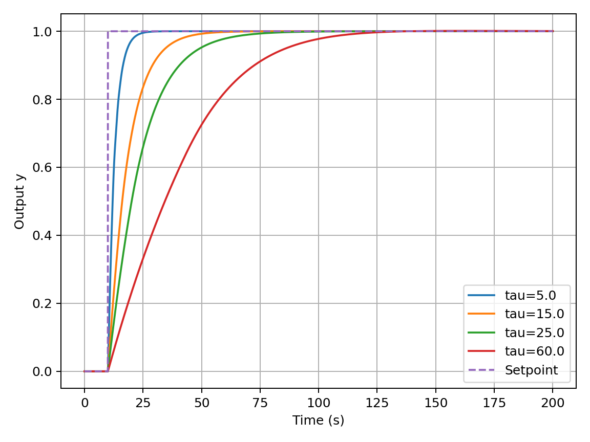
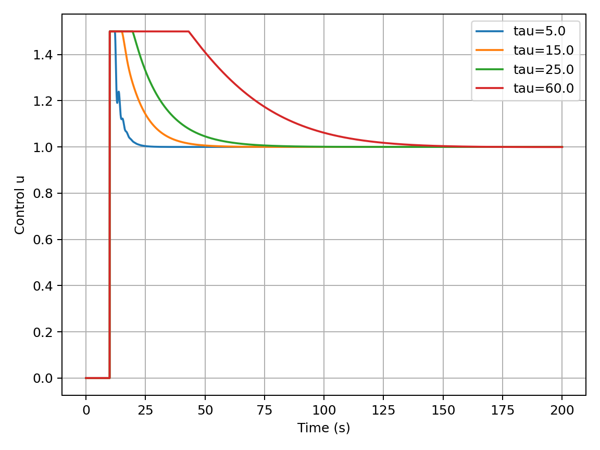

# Robust Gain-Scheduled PI Controller  
Industrial-Style Control Design with Saturation Constraints

---

## Project Overview

This project implements and evaluates a gain-scheduled PI controller for a first-order dynamic system with actuator saturation.

The objective is to design a controller that:

- Works across multiple time constants (τ)
- Respects actuator limits
- Minimizes worst-case performance degradation
- Remains stable and robust under parameter variation

The system model:

dy/dt = (-(y - T_amb) + K u) / τ

---

## Why This Matters (Industrial Context)

In real industrial systems:

- The plant time constant may vary
- Actuators have hard limits
- Aggressive control can cause saturation and windup
- Performance must be robust across operating conditions

This project explicitly addresses those constraints.

---

## Implemented Features

✔ First-order plant simulation  
✔ PI controller with:
- Anti-windup (back-calculation)
- Actuator saturation limits
- Measurement low-pass filtering  

✔ Gain scheduling strategy:

Kp(τ) = a / τ  
Ti(τ) = b τ  
Ki = Kp / Ti  

✔ Robust optimization:
- Worst-case cost across multiple τ values
- Saturation-aware penalty
- Hard overshoot constraint

✔ Automatic generation of performance plots

---

## Optimization Strategy

The cost function combines:

- Settling time
- Overshoot
- Steady-state error
- Saturation penalty (quadratic beyond threshold)

The schedule parameters (a, b) are optimized to minimize worst-case cost across all τ values.

---

## Project Structure

adaptive-control-lab/
│
├─ src/ # Core control & simulation modules
├─ scripts/ # Executable entry points
├─ results/ # Generated plots
├─ README.md
└─ requirements.txt

---

## Installation

Install dependencies:

pip install -r requirements.txt

---

## Run Optimization

From project root:

python scripts/run_optimize.py

The script will:

- Optimize gain-schedule parameters
- Print performance metrics
- Save plots to:

results/outputs.png  
results/controls.png  

---

## Example Output

### System Response

### Control Signal

---

## Design Philosophy

This project focuses on:

- Practical constraint-aware control
- Robust design across parameter uncertainty
- Clear modular structure
- Industrial engineering mindset

No black-box ML.  
No idealized unlimited actuators.  
Real constraints considered.

---

## Future Extensions

- Online parameter estimation (system identification)
- Adaptive gain scheduling
- Model uncertainty in plant gain K
- Extension to higher-order systems

---

## Author

Control systems engineer focused on robust and adaptive control design.